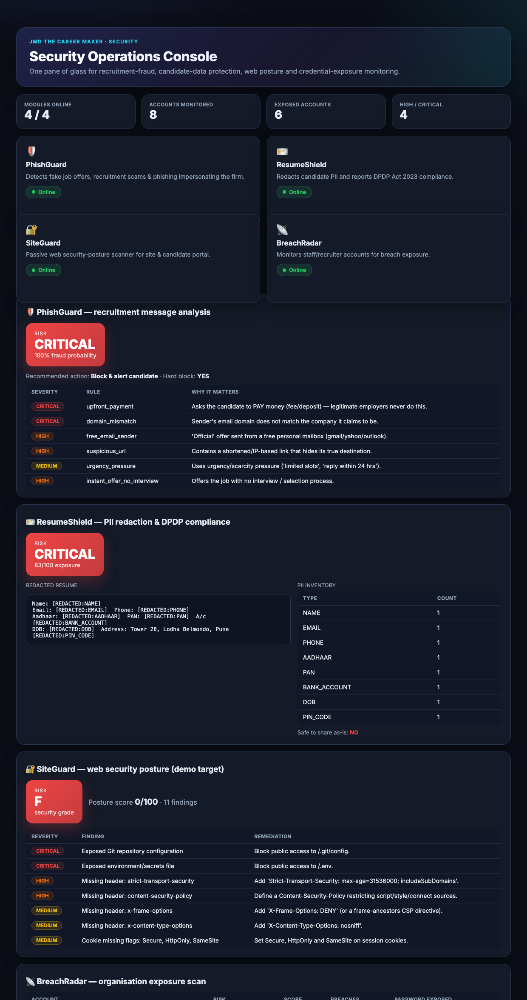

# 🛡️ JMD Security Suite

**Three AI/cybersecurity tools built for the AI Cybersecurity internship at
JMD The Career Maker** — each one targets a *real* operational risk for a
career-consulting firm and maps directly to the appointment-letter duties
(*AI-driven threat detection, vulnerability assessments, security automation
with AI/ML, threat intelligence, SOC workflows, technical reports*).

| Tool | Organisational problem it solves | Maps to duty |
|---|---|---|
| 🪪 **ResumeShield** | Candidate resumes are full of PII (Aadhaar, PAN, bank a/c) that must be protected before sharing with employers — a **DPDP Act 2023** legal duty. | Security automation w/ AI-ML |
| 🔐 **SiteGuard** | The firm's website & candidate portal may leak secrets or miss security headers. | Vulnerability assessment |
| 📡 **BreachRadar** | Staff/recruiter accounts (HR, careers, finance) may already be exposed in data breaches. | Threat intelligence / SOC |

> A complementary fourth tool, **PhishGuard** (recruitment-fraud & phishing
> detection), lives in a separate repo: [`jmd-phishguard`](https://github.com/gdfazal/jmd-phishguard).



---

## ⭐ Unified premium console

All four tools live behind a single dark, premium **Security Console** and one REST API:

```bash
cd ~/jmd_security_suite
./run.sh console   # 🛡️ premium unified dashboard  → http://localhost:8501
./run.sh api       # unified REST API (FastAPI)    → http://localhost:8000/docs
```

The console has an **Overview** page (live KPIs + tool cards + exposure snapshot) and a
dedicated page per tool. Both console and API call one shared adapter
(`console/integrations.py`), so they can never drift apart.

## Quickstart

```bash
./run.sh setup     # install deps (already done)
./run.sh data      # build BreachRadar corpus (already done)
./run.sh test      # run all 27 tests
./run.sh demo      # CLI demo of the three suite tools

# individual dashboards (also available standalone)
./run.sh resumeshield   # / siteguard / breachradar
```

### REST API endpoints
`GET /health` · `GET /tools` · `POST /phishguard/analyze` · `POST /resumeshield/redact`
· `POST /siteguard/scan` · `POST /breachradar/check` · `GET /breachradar/scan-org`

---

## 🪪 ResumeShield — `resumeshield/`
Detects & redacts PII from candidate documents and emits a **DPDP compliance report**.
- India-aware detectors with validation: **Aadhaar (Verhoeff checksum)**, PAN, GSTIN,
  passport, **credit card (Luhn)**, bank account (context-gated), email, phone, DOB, PIN.
- Risk score + band, redacted output, audit log, "safe-to-share" verdict.
- `python -m resumeshield.cli resume.pdf` · `streamlit run resumeshield/app.py`

## 🔐 SiteGuard — `siteguard/`
Passive, **non-intrusive** web security-posture scanner for domains you control.
- Checks security headers (HSTS, CSP, X-Frame-Options…), cookie flags, banner leakage,
  TLS version, and probes for exposed files (`/.git/config`, `/.env`).
- Letter-grade (A–F) posture score with prioritised, remediation-first findings.
- Live scans are **gated behind an explicit authorization flag**; an offline demo mode
  needs no network.
- `python -m siteguard.cli --demo vulnerable` · `... https://yourdomain.com --authorize`

## 📡 BreachRadar — `breachradar/`
Credential-exposure monitor over a **local, synthetic** breach corpus (offline & safe).
- **Privacy-preserving k-anonymity** hash-prefix lookup (HIBP range-API model).
- Risk scoring by breach severity, recency, password exposure, and high-value role.
- Org-wide scan + per-account remediation advice.
- `python -m breachradar.cli scan-org` · `streamlit run breachradar/app.py`

---

## Design principles
- **Explainable:** every verdict lists the concrete signals behind it.
- **Safe by default:** no destructive actions; live scanning requires authorization;
  breach data is synthetic; PII is redacted, never stored.
- **Tested:** 20 standalone tests (`./run.sh test`), no network required.
- **Reproducible:** seeded datasets, pinned deps, Python 3.14.

## Honest scope note
Datasets/corpora here are synthetic so the suite is self-contained and reproducible.
The transferable value is the detection logic, the privacy-preserving design, and the
analyst workflow — all of which apply directly to real candidate data, real domains,
and a real breach feed when connected.
